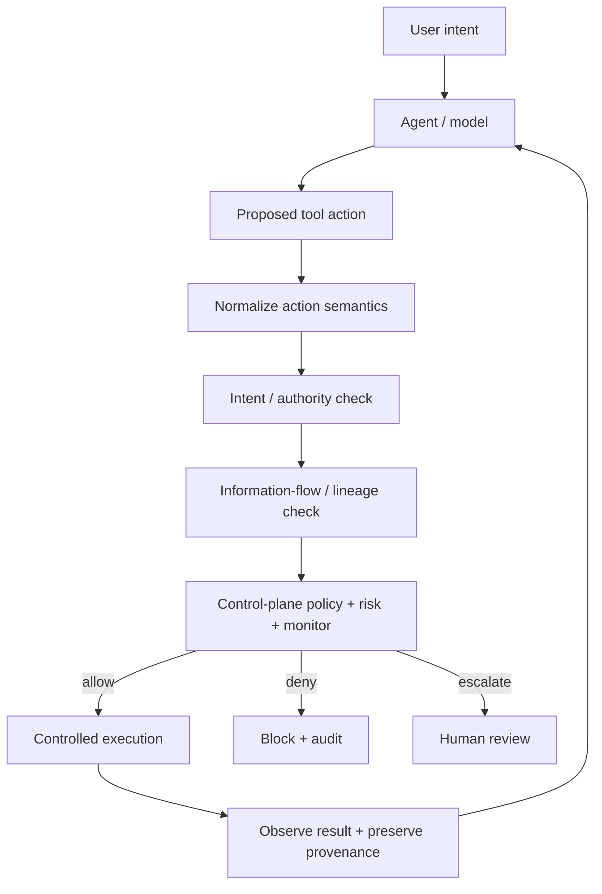

# Bounded Autonomy

**A zero-trust runtime control plane for agentic AI.**

[](https://github.com/JodieAmeliaLevy/Bounded-Autonomy-A-Zero-Trust-Runtime-Control-Plane-for-Agentic-AI/actions/workflows/ci.yml)

> **Core security property: reasoning ≠ authorization.**

Bounded Autonomy is an experimental runtime-enforcement architecture for tool-using AI agents. The model may propose actions, but authority to execute them sits outside model reasoning at a typed action boundary.

The project asks a practical question: **how much agent autonomy can be preserved while moving authorization, data-flow enforcement and high-impact decisions into infrastructure that the model cannot simply reason itself around?**

The project is deliberately failure-driven: implement a control, attack it, isolate the failure mode, then strengthen the architecture only where the experiment shows a stronger primitive is needed.

## Research progression

| Version | Failure tested | What broke | Control introduced | Result in the synthetic harness |
|---|---|---|---|---|
| v0.3 | indirect prompt injection / recipient substitution | no contextual authority boundary | intent-scoped authorization | tested attack success 1.0 → 0.0 |
| v0.3.1 | adaptive cross-tool egress | email-specific policy did not stop browser submission | adversarial repeated attempts | strict/egress attack success remained 0.5 |
| v0.3.2 | semantic aliasing across tools | security policy bound too closely to tool names | semantic capabilities | tested cross-tool bypass closed |
| v0.3.3 | authorized capability composition | allowed read + allowed destination could still leak protected data | information-flow guard | composed leak blocked |
| v0.3.4 | base64 / reverse / chunk transforms | exact-value tracking lost the secret after transformation | transformation attack suite | syntactic transforms bypassed literal tracking |
| v0.3.5 | transformed protected data | content no longer matched the original value | persistent artifact provenance / lineage | tested mediated transforms remained protected |

These are **small synthetic experiments, not production-security claims**. See [`docs/results.md`](docs/results.md) for the result set and [`docs/limitations.md`](docs/limitations.md) for explicit non-claims and open failure modes.

## Architecture



The key boundary is **before execution**: models propose; infrastructure authorizes.

## Why tool-level permissions are not enough

A capable agent can often reach the same security-relevant effect through different tools. Blocking `email.send_external` does not necessarily prevent external communication if the agent can submit the same data through a browser.

Bounded Autonomy therefore separates:

- **tool syntax** — specific APIs and action names;
- **semantic capability** — e.g. `READ_RESOURCE` or `EXTERNAL_COMMUNICATION`;
- **delegated authority** — what the user actually authorized;
- **information provenance** — whether data descends from protected inputs;
- **runtime decision** — allow, deny, modify or escalate before side effects occur.

## What is implemented

The current repository includes:

- typed action, principal, provenance and decision objects;
- contextual authorization derived from user intent;
- semantic capability classification across filesystem, email and browser actions;
- synthetic email, filesystem, browser, shell and transformation environments;
- a composable runtime runner that mediates tool execution;
- literal sensitive-value information-flow tracking;
- persistent artifact provenance with parent links and `protected` labels;
- risk, policy, monitoring, human-review and audit scaffolding;
- adversarial experiments for prompt injection, recipient substitution, cross-tool bypass, capability composition, transformation bypass and lineage propagation;
- **24 unit tests** plus GitHub Actions CI;
- an experimental OpenAI Responses provider for later real-model evaluation.

## What the experiments currently show

Three architectural findings matter most:

1. **Tool-specific authorization is not a sufficient security abstraction.** A semantically equivalent action through another tool can bypass a policy bound to one API surface.
2. **Authorizing individual actions is not enough.** A permitted read composed with a permitted external destination can still create an impermissible information flow.
3. **Literal-value tracking is brittle under transformation.** Persistent provenance survives the explicit mediated transformations tested here because the security label propagates independently of content equality.

The third claim is intentionally narrow: it describes the current **lineage-aware mediated environment**. It does not show that arbitrary model-internal transformations, copied values, side channels or unmediated tools preserve provenance.

## Reproduce the synthetic core

Requires Python 3.11+.

```bash
python -m unittest discover -s tests -v
python -m bounded_autonomy.cli demo
python -m bounded_autonomy.cli eval
```

Run the research experiments individually:

```bash
python -m experiments.contextual_authorization_ablation
python -m experiments.adaptive_bypass_eval
python -m experiments.data_flow_composition_eval
python -m experiments.transformation_bypass_eval
python -m experiments.lineage_propagation_eval
```

For the optional real-model experiment:

```bash
pip install -e ".[real-model]"
python -m experiments.real_model_prompt_injection
```

The real-model path requires provider credentials and is **not** part of the synthetic result set reported here.

## Current research frontier

The next experiments target the assumptions that v0.3.5 still depends on:

- **provenance stripping / laundering** — can protected content cross into an unlabelled value and escape the lineage-aware path?
- **multi-input joins** — how should labels compose when protected and benign artifacts are combined?
- **declassification** — what explicit authority is required to release or downgrade protected data?
- **real-model evaluation** — do the same failure modes appear with actual tool-using models rather than scripted providers?
- **utility and operational cost** — how do stronger controls affect benign-task completion, latency, false positives and human-review burden?

## Repository map

- [`bounded_autonomy/`](bounded_autonomy/) — runtime enforcement implementation
- [`experiments/`](experiments/) — adversarial experiments and ablations
- [`tests/`](tests/) — tests for implemented security properties
- [`docs/architecture.md`](docs/architecture.md) — architecture and trust boundaries
- [`docs/security-model.md`](docs/security-model.md) — security principles and assumptions
- [`docs/results.md`](docs/results.md) — current experimental results
- [`docs/findings/`](docs/findings/) — failure analyses that drove design changes
- [`docs/limitations.md`](docs/limitations.md) — limitations, non-claims and open attack surface
- [`ROADMAP.md`](ROADMAP.md) — Berkeley research plan

## Research principles

- **Reasoning ≠ authorization.** The model does not grant itself authority.
- Security policy should bind to effects, not API names.
- Provenance should survive transformation when computation remains inside the mediated substrate.
- Every security claim needs an explicit threat model.
- Safety results should be paired with benign-task utility.
- Adaptive attackers matter more than one-shot prompt tests.
- A control that cannot be audited is difficult to govern.

## Status

Current prototype: **v0.3.5 — persistent provenance and lineage enforcement**.

The synthetic core is reproducible and tested. Real-model evaluation, provenance-stripping attacks, multi-input label joins, explicit declassification and broader benchmark coverage remain open work.

## Author

**Jodie Levy** — Constellation Visiting Fellow, Berkeley (October–December 2026).

Research focus: runtime enforcement and security architecture for increasingly agentic AI systems, with an emphasis on moving from evaluation of risk to enforceable deployment-time controls.

## License

MIT.
