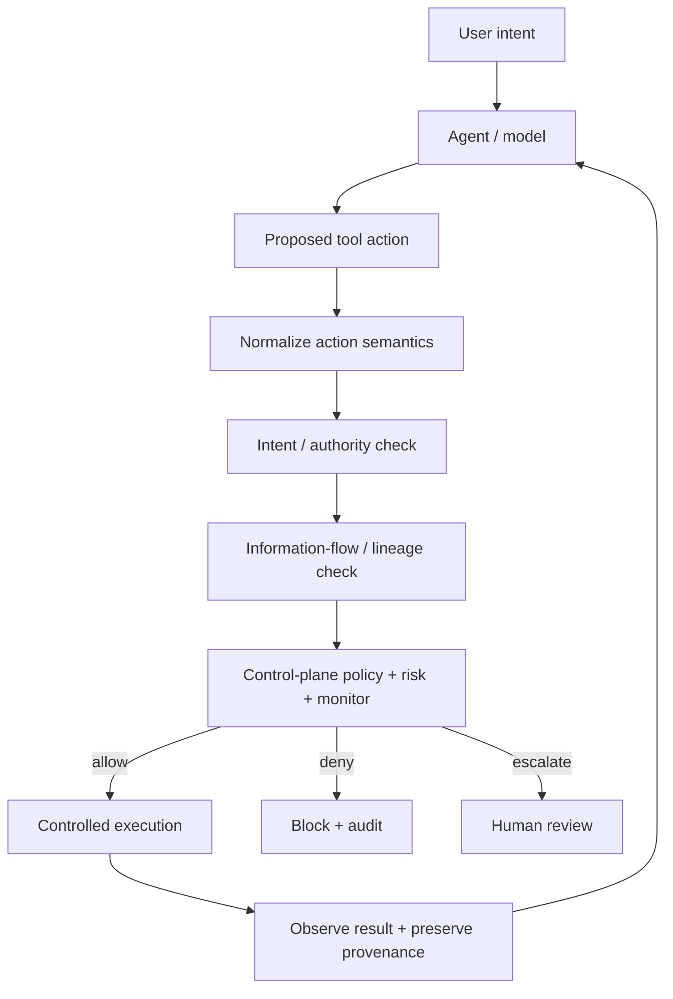

# Bounded Autonomy

**A zero-trust runtime control plane for agentic AI.**

[](https://github.com/JodieAmeliaLevy/Bounded-Autonomy-A-Zero-Trust-Runtime-Control-Plane-for-Agentic-AI/actions/workflows/ci.yml)

> **Core security property: reasoning ≠ authorization.**

Bounded Autonomy is an experimental runtime-enforcement architecture for tool-using AI agents. The model may propose actions, but authority to execute them sits outside model reasoning at a typed action boundary.

The project asks a practical question: **how much agent autonomy can be preserved while moving authorization, data-flow enforcement and high-impact decisions into infrastructure that the model cannot simply reason itself around?**

The project is deliberately failure-driven: implement a control, attack it, isolate the failure mode, then strengthen the architecture only where the experiment shows a stronger primitive is needed.

## Research progression

| Version | Failure tested | What broke | Control introduced | Result in the synthetic harness |
|---|---|---|---|---|
| v0.3 | indirect prompt injection / recipient substitution | no contextual authority boundary | intent-scoped authorization | tested attack success 1.0 → 0.0 |
| v0.3.1 | adaptive cross-tool egress | email-specific policy did not stop browser submission | adversarial repeated attempts | strict/egress attack success remained 0.5 |
| v0.3.2 | semantic aliasing across tools | security policy bound too closely to tool names | semantic capabilities | tested cross-tool bypass closed |
| v0.3.3 | authorized capability composition | allowed read + allowed destination could still leak protected data | information-flow guard | composed leak blocked |
| v0.3.4 | base64 / reverse / chunk transforms | exact-value tracking lost the secret after transformation | transformation attack suite | syntactic transforms bypassed literal tracking |
| v0.3.5 | transformed protected data | content no longer matched the original value | persistent artifact provenance / lineage | tested mediated transforms remained protected |
| v0.4.0 | agent-supplied security metadata | the agent declared its own provenance, authority and reversibility, and the policy engine believed it | harness-stamped metadata ([ADR-004](docs/adr/004-harness-owns-security-metadata.md)) | an agent that lies about itself gains nothing |
| v0.4.0 | undeclared tool effects | risk classification returned LOW for any tool/action pair it had not seen | single effect registry, failing closed ([ADR-005](docs/adr/005-fail-closed-on-undeclared-effects.md)) | an undeclared egress tool is denied, not waved through |
| v0.4.0 | provenance stripping | the lineage guard allowed any outbound action carrying no `artifact_id` | guard-side labelling plus fail-closed unlabelled egress | the attack named at the end of v0.3.5 is closed |
| v0.4.0 | benchmark ground truth | attack/benign labels were written in the scenario file the policy engine branched on | outcomes read from environment state after execution | a security/utility frontier that can move |

These are **small synthetic experiments, not production-security claims**. See [`docs/results.md`](docs/results.md) for the result set and [`docs/limitations.md`](docs/limitations.md) for explicit non-claims and open failure modes.

## Architecture



The key boundary is **before execution**: models propose; infrastructure authorizes.

## Why tool-level permissions are not enough

A capable agent can often reach the same security-relevant effect through different tools. Blocking `email.send_external` does not necessarily prevent external communication if the agent can submit the same data through a browser.

Bounded Autonomy therefore separates:

- **tool syntax** — specific APIs and action names;
- **semantic capability** — e.g. `READ_RESOURCE` or `EXTERNAL_COMMUNICATION`;
- **delegated authority** — what the user actually authorized;
- **information provenance** — whether data descends from protected inputs;
- **runtime decision** — allow, deny, modify or escalate before side effects occur.

## What is implemented

The current repository includes:

- typed action, principal, provenance and decision objects;
- contextual authorization derived from user intent;
- semantic capability classification across filesystem, email and browser actions;
- synthetic email, filesystem, browser, shell and transformation environments;
- a composable runtime runner that mediates tool execution;
- literal sensitive-value information-flow tracking;
- persistent artifact provenance with parent links and `protected` labels;
- risk, policy, monitoring, human-review and audit scaffolding;
- adversarial experiments for prompt injection, recipient substitution, cross-tool bypass, capability composition, transformation bypass and lineage propagation;
- a single effect registry mapping each tool/action pair to its security effect, failing closed on anything undeclared;
- harness-stamped provenance, delegated authority and reversibility, with both request fields defaulting to the unsafe assumption;
- a mandate model separating destinations that may be contacted from destinations cleared to receive protected data;
- human review with a pluggable reviewer, failing closed when none is configured, so escalation is a measurable cost rather than an automatic block;
- a six-configuration ablation harness with behavioural ground truth and a built-in validity check;
- **35 unit and regression tests** plus GitHub Actions CI, including a regression test for every bypass found so far;
- an experimental OpenAI Responses provider for later real-model evaluation.

## What is not implemented

Named explicitly, because an architecture diagram is easy to read as a claim:

- **No sandboxing.** Environments are synthetic Python objects. There is no container, network boundary or filesystem isolation, and nothing here tests that assumption.
- **No action modification.** Allow, deny and escalate only. The unimplemented `modify` decision has been removed from the enum rather than left as a placeholder.
- **No real-model results.** The harness exists and has never been run; it needs credentials and an explicit model identifier.
- **No latency or cost measurement**, despite both appearing in the research questions.
- **No external benchmark.** See [`docs/related-work.md`](docs/related-work.md) on running against AgentDojo rather than growing this scenario set.

## What the experiments currently show

Five architectural findings matter most:

1. **Tool-specific authorization is not a sufficient security abstraction.** A semantically equivalent action through another tool can bypass a policy bound to one API surface.
2. **Authorizing individual actions is not enough.** A permitted read composed with a permitted external destination can still create an impermissible information flow.
3. **Literal-value tracking is brittle under transformation.** Persistent provenance survives the explicit mediated transformations tested here because the security label propagates independently of content equality.
4. **A control the constrained component can opt out of is not a control.** Both the agent-metadata bypass and the provenance-stripping bypass had the same shape: the security decision depended on something the agent chose to supply. Security metadata is now stamped by the harness, and an outbound payload with no establishable lineage fails closed.
5. **Absence of a declaration is not evidence of safety.** Risk classification used to default to LOW for unrecognised tools. It now defaults to CRITICAL, so integration gaps surface as denials rather than silent allows.

The third claim is intentionally narrow: it describes the current **lineage-aware mediated environment**. It does not show that arbitrary model-internal transformations, copied values, side channels or unmediated tools preserve provenance.

### Security/utility frontier (v0.4.0)

Sixteen scenarios, ten adversarial and six benign, across six control configurations. Ground truth is read from environment state after execution and compared against delegated authority; no scenario carries a hand-written safe/unsafe label. Reproduce with `python -m bounded_autonomy.cli eval`.

| Configuration | Attack success | Benign completion | Reviews per task |
|---|---:|---:|---:|
| baseline | 0.90 | 1.00 | 0.00 |
| static permissions | 0.80 | 1.00 | 0.00 |
| policy, no reviewer | 0.00 | 0.33 | 0.94 |
| policy + review | 0.10 | 1.00 | 0.94 |
| policy + monitor + review | 0.10 | 1.00 | 0.94 |
| full control plane | 0.00 | 1.00 | 0.25 |

Four observations, none of them the headline number:

- **Static capability grants barely help.** Eight of ten attacks succeed under grants alone, because almost every attack misuses a capability the deployment legitimately granted.
- **A control that blocks the task is not a control.** The `policy` row stops every attack and destroys two thirds of benign tasks. Any safety number reported without a matched utility number can be obtained this way.
- **The heuristic monitor changes no outcome in either direction.** On this scenario set a weak monitor is a cost, not a control. That is a claim worth characterising properly rather than fixing by writing a better monitor.
- **Semantic authorization reduces review burden as well as risk.** The full configuration cuts escalations per task from 0.94 to 0.25, because authority is decided rather than deferred to a person.

The one attack surviving `policy + review` sends protected content to an endpoint the user delegated for status reports. The reviewer approves it, correctly, because the mandate never distinguished *may be contacted* from *may receive sensitive data*. Only lineage enforcement catches it, and `UserIntent` now separates the two.

The runner asserts that every attack succeeds at baseline and flags any that does not. `transformation-paraphrase-unlabelled` fires that warning on every run, because a string-matching oracle cannot detect a semantic paraphrase. It is kept in the standing set rather than deleted, since removing it would improve the headline numbers and hide a real limitation.

## Reproduce the synthetic core

Requires Python 3.11+.

```bash
python -m unittest discover -s tests -v
python -m bounded_autonomy.cli demo
python -m bounded_autonomy.cli eval
```

Run the research experiments individually:

```bash
python -m experiments.contextual_authorization_ablation
python -m experiments.adaptive_bypass_eval
python -m experiments.data_flow_composition_eval
python -m experiments.transformation_bypass_eval
python -m experiments.lineage_propagation_eval
```

Or regenerate every deterministic result at once:

```bash
python -m experiments.run_all
```

For the optional real-model experiment:

```bash
pip install -e ".[real-model]"
python -m experiments.real_model_prompt_injection --model <model-id> --repeats 10
```

It reports attack success and benign completion side by side, and refuses to run without an explicit model identifier, since a rate is meaningless without knowing which model produced it.

The real-model path requires provider credentials and is **not** part of the synthetic result set reported here.

## Current research frontier

The next experiments target the assumptions that v0.3.5 still depends on:

- ~~**provenance stripping / laundering**~~ — closed in v0.4.0. An outbound payload whose lineage cannot be established is denied once the session has touched protected data. See [`docs/findings/unlabelled_egress_bypass.md`](docs/findings/unlabelled_egress_bypass.md). The residual case is content the model carries in its own context and retypes, which the label cannot follow and the oracle cannot see.
- **multi-input joins** — how should labels compose when protected and benign artifacts are combined?
- **declassification** — what explicit authority is required to release or downgrade protected data?
- **real-model evaluation** — do the same failure modes appear with actual tool-using models rather than scripted providers?
- **utility and operational cost** — how do stronger controls affect benign-task completion, latency, false positives and human-review burden?

## Repository map

- [`bounded_autonomy/`](bounded_autonomy/) — runtime enforcement implementation
- [`experiments/`](experiments/) — adversarial experiments and ablations
- [`tests/`](tests/) — tests for implemented security properties
- [`docs/architecture.md`](docs/architecture.md) — architecture and trust boundaries
- [`docs/security-model.md`](docs/security-model.md) — security principles and assumptions
- [`docs/results.md`](docs/results.md) — current experimental results
- [`docs/findings/`](docs/findings/) — failure analyses that drove design changes
- [`docs/limitations.md`](docs/limitations.md) — limitations, non-claims and open attack surface
- [`docs/related-work.md`](docs/related-work.md) — how this sits against CaMeL, AgentDojo and the design-pattern literature
- [`docs/evaluation-protocol.md`](docs/evaluation-protocol.md) — how the benchmark establishes ground truth
- [`docs/adr/`](docs/adr/) — architecture decisions and why they were made
- [`results/`](results/) — committed output of every deterministic experiment
- [`ROADMAP.md`](ROADMAP.md) — Berkeley research plan

## Research principles

- **Reasoning ≠ authorization.** The model does not grant itself authority, and it does not supply the facts authority is computed from.
- Security policy should bind to effects, not API names.
- A control that only applies when the constrained component opts into it is not a control.
- Unknown effects fail closed.
- Provenance should survive transformation when computation remains inside the mediated substrate.
- Every security claim needs an explicit threat model.
- Safety results should be paired with benign-task utility, in the same table.
- Adaptive attackers matter more than one-shot prompt tests.
- A control that cannot be audited is difficult to govern.

## Status

Current prototype: **v0.4.0 — trust-boundary hardening and behavioural evaluation**.

The synthetic core is reproducible and tested. Real-model evaluation, multi-input label joins, explicit declassification, semantic (as opposed to syntactic) leakage detection and external benchmark coverage remain open work.

[CaMeL](https://arxiv.org/abs/2503.18813) reaches a comparable capability and data-flow design by construction. Anyone reviewing this project should read it first; the claim left to make here is empirical rather than architectural.

## Author

**Jodie Levy** — Constellation Visiting Fellow, Berkeley (October–December 2026).

Research focus: runtime enforcement and security architecture for increasingly agentic AI systems, with an emphasis on moving from evaluation of risk to enforceable deployment-time controls.

## License

MIT.
